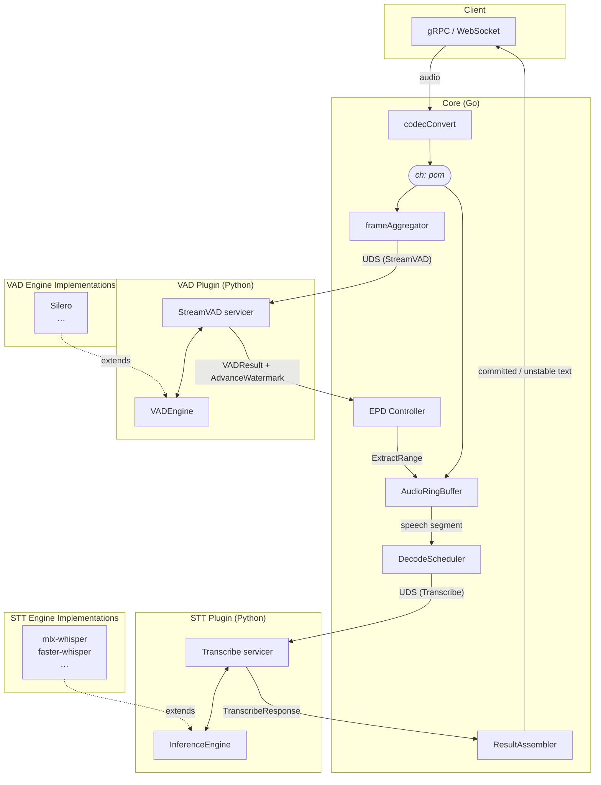

# SpeechMux

A Go-based streaming speech-to-text gateway that orchestrates multiple STT engines and VAD plugins. Core (Go) handles session management, routing, end-of-speech detection, backpressure, and fault recovery. VAD and Inference plugins (Python) run as gRPC sidecars over Unix domain sockets.

## Architecture



- **Frame aggregation**: Core collects client audio chunks (e.g. 20 ms) and re-frames them to the VAD plugin's `optimal_frame_ms` (e.g. 32 ms for Silero) before sending, reducing IPC overhead.
- **Watermark-based trim**: `AudioRingBuffer.Trim()` only evicts entries with `sequence_number <= confirmedWatermark` AND age exceeding `max_buffer_sec`. Audio not yet confirmed by VAD is never evicted, regardless of age.
- **Backpressure**: When `AudioRingBuffer.Append()` returns false (buffer full), the pipeline goroutine blocks on `stream.Recv()`, filling the HTTP/2 flow control window and naturally throttling the client. In REALTIME mode, the oldest entry is dropped instead to prevent mic stalls.
- **Committed / unstable text**: On each partial decode Core computes the Longest Common Prefix (LCP) between the previous and current partial text, then advances `committed_text` to the nearest word boundary (space) or punctuation boundary (`.,?!。、，！？…`) within that LCP. CJK text without spaces commits character-by-character at the LCP boundary. `committed_text` is monotonically increasing — it never shrinks. On final decode: `committed_text = full text`, `unstable_text = ""`.

## Streaming Protocol

`StreamingRecognize` is a single bidirectional gRPC stream. The first message must be
`session_config`; all subsequent messages are `audio` or `signal`.

**Client → Core:**

| Message | When |
|---------|------|
| `session_config` | First message only — creates the session |
| `audio` (bytes) | PCM / WAV / encoded audio chunks |
| `signal { is_last: true }` | End of audio — triggers final decode |

**Core → Client:**

| Message | When |
|---------|------|
| `session_created` | First response — echoes negotiated audio + recognition config |
| `recognition_result` | Streamed continuously — `committed_text`, `unstable_text`, `is_final` |
| `stream_error { error_code, retryable }` | On error — stream closes after this |

On `ERR3004` (VAD stream failure) or `ERR3005` (buffer overflow), `retryable: true` — the
client should open a new stream and replay the last ~2 s of audio (overlap) to avoid losing
the unstable segment.

## Repositories

Each component lives in its own repository under the `speechmux` GitHub organization.

| Repo | Language | Role |
|------|----------|------|
| `proto` | Protobuf | Proto definitions + generated Go/Python code (single source of truth) |
| `core` | Go | gRPC/WS server, session management, EPD, decode scheduling, routing |
| `plugin-vad` | Python | VAD plugin base (servicer, VADEngine Protocol, Dummy engine) |
| `plugin-vad-silero` | Python | Silero VAD v5 engine |
| `plugin-stt` | Python | STT plugin base (servicer, InferenceEngine Protocol, Dummy engine) |
| `plugin-stt-mlx-whisper` | Python | mlx-whisper engine (MLX, Apple Silicon) |
| `plugin-stt-faster-whisper` | Python | faster-whisper engine (CTranslate2, CPU/CUDA) |
| `plugin-stt-torch-whisper` | Python | torch-whisper engine (PyTorch, CPU/MPS/CUDA) |
| `client-cli` | Python | CLI client (file, batch, microphone) |
| `client-web` | TS/Python | Next.js 15 frontend + FastAPI WebSocket proxy |
| `deploy` | HCL | HashiCorp Nomad job specs for macOS Metal/MPS deployment |

## Quick Start

### Prerequisites

- Go 1.25+
- Python 3.13+
- [uv](https://docs.astral.sh/uv/) package manager
- Node.js 22+ (for `client-web` only)
- Protocol Buffers compiler (`protoc`, for proto regeneration only)

### Clone

Clone this workspace root first, then pull the repos you need.

```bash
git clone git@github.com:speechmux/speechmux.git
cd speechmux

# Base layer — always required
make clone-base                    # proto, core, plugin-vad, plugin-stt

# VAD engine — pick one
make clone-vad IMPL=silero         # plugin-vad-silero

# STT engine — pick one (run again to add more)
make clone-stt IMPL=mlx-whisper    # Apple Silicon
make clone-stt IMPL=faster-whisper # CPU / CUDA

# Clients (optional)
make clone-web                     # client-web
make clone-cli                     # client-cli
```

### Install

```bash
make setup                         # creates .venv (Python 3.13) if absent, then installs
                                   # proto/gen/python + every cloned plugin
                                   # and client via uv (plugin-vad, plugin-vad-*,
                                   # plugin-stt, plugin-stt-*, client-cli,
                                   # client-web/api — whatever is present on disk)
                                   # Run 'make proto' only when .proto files change
                                   # (requires grpcio-tools in the venv)

# Web client frontend (if cloned) — Node side needs a separate install
cd client-web/web && npm install && cd ../..
```

### Build

```bash
make build   # builds core/bin/speechmux-core
```

### Run

```bash
make run       # VAD → STT → Core (sequential startup with socket polling)
make stop      # graceful shutdown of backend (VAD + STT + Core)
make stop-all  # stop backend + web client + Caddy
make status    # check process states
make logs      # list log files
```

Or run each component manually:

```bash
mkdir -p /tmp/speechmux

.venv/bin/python3 -m speechmux_plugin_vad.main \
    --config plugin-vad/config/vad.yaml &

.venv/bin/python3 -m speechmux_plugin_stt.main \
    --config plugin-stt/config/inference.yaml &

core/bin/speechmux-core \
    --config core/config/core.yaml \
    --plugins core/config/plugins.yaml
```

### Web Client

```bash
make run-web            # FastAPI proxy + Next.js (plain HTTP, localhost)
make run-web-caddy      # FastAPI proxy + Next.js + Caddy (HTTPS, mic access)
make run-all            # Core + web client (plain HTTP)
make run-all-caddy      # Core + web client + HTTPS via Caddy
make run-all-tailscale  # Core + web client + Tailscale HTTPS tunnel (remote devices)
make stop-web           # stop FastAPI proxy + Next.js
make stop-caddy         # stop Caddy only
```

Run `make caddy-trust` once to install Caddy's local CA into the system trust store
(needed for `run-web-caddy` to avoid certificate warnings).

### Transcribe (CLI)

Requires `client-cli` to be cloned (`make clone-cli`) and installed (`make setup`).

```bash
.venv/bin/speechmux file audio.wav --lang ko
.venv/bin/speechmux batch ./audio_dir/ --lang ko --output ./results/
.venv/bin/speechmux mic --lang ko
```

### Load Test (no model required)

```bash
# One-shot: start dummies + run loadtest + stop everything
make loadtest

# Or step-by-step for custom loadtest parameters
make run-dummy  # Dummy VAD + Dummy STT + Core
cd core && go run ./tools/loadtest/ --sessions 100 --duration 5m
make stop
```

## Configuration

All configuration is YAML-based. See each file for detailed inline comments.

| File | Purpose |
|------|---------|
| `core/config/core.yaml` | Server ports, session limits, stream pipeline tuning, auth, TLS, OTel |
| `core/config/plugins.yaml` | VAD/inference plugin endpoints, routing mode, health check intervals |
| `plugin-vad/config/vad.yaml` | VAD socket, engine, log level, concurrency, Silero model thresholds |
| `plugin-vad/config/vad-dummy.yaml` | VAD dummy engine config for load testing |
| `plugin-stt/config/inference.yaml` | STT socket, engine, log level, concurrency, model selection, decode hyperparameters |
| `plugin-stt/config/inference-dummy.yaml` | STT dummy engine config for load testing |

### Decode Profiles

`core.yaml` includes named decode profiles that clients select via `RecognitionConfig.decode_profile`:

| Profile | beam_size | best_of | temperature | Use Case |
|---------|-----------|---------|-------------|----------|
| `realtime` | 1 | 1 | 0.0 | Live microphone, low latency |
| `accurate` | 5 | 5 | 0.0 | Batch file transcription, higher accuracy |

### Plugin Routing Modes

Configured in `plugins.yaml` under `inference.routing_mode`:

| Mode | Behavior |
|------|----------|
| `round_robin` | Distribute sessions sequentially across healthy endpoints |
| `least_connections` | Pick endpoint with fewest in-flight requests |
| `active_standby` | Prefer highest-priority endpoint; failover if unhealthy |

### Plugin Circuit Breaker

Configured in `plugins.yaml` under `inference.circuit_breaker`:

```
CLOSED ──[failure_threshold consecutive failures]──→ OPEN
OPEN   ──[half_open_timeout_sec elapsed]──────────→ HALF_OPEN
HALF_OPEN ──[HealthCheck pass]──→ CLOSED
HALF_OPEN ──[HealthCheck fail]──→ OPEN
```

| Key | Default | Effect |
|-----|---------|--------|
| `failure_threshold` | 5 | Consecutive RPC failures to trip the breaker |
| `half_open_timeout_sec` | 30 | Seconds in OPEN before a probe is attempted |

### Config Hot-reload Scope

`core.yaml` is reloaded on SIGHUP (`kill -HUP <pid>`). Not all fields take effect immediately:

| When | Fields |
|------|--------|
| **Immediate** (all running sessions) | `vad_silence_sec`, `vad_threshold`, `decode_timeout_sec`, `speech_rms_threshold`, `partial_decode_interval_sec` |
| **New sessions only** | `max_sessions`, `auth_*`, `codec.target_sample_rate`, `rate_limit.*`, `decode_profiles.*` |
| **Requires restart** | `grpc_port`, `http_port`, `ws_port`, `tls.*` |
| **Dynamic via Admin API** | `plugins.yaml` endpoints — added/removed at runtime without restart |

## Error Codes

All errors follow the `ERR####` scheme. Codes are permanently assigned and never reused.

| Range | Category | Examples |
|-------|----------|----------|
| `ERR1xxx` | Client errors | ERR1001 missing session_id, ERR1004 unauthenticated, ERR1012 rate limited |
| `ERR2xxx` | Decode pipeline | ERR2001 decode timeout, ERR2005 all plugins unavailable, ERR2008 queue full |
| `ERR3xxx` | Internal errors | ERR3003 codec failure, ERR3004 VAD stream failure, ERR3005 buffer overflow |
| `ERR4xxx` | Admin/HTTP | ERR4001 admin disabled, ERR4004 invalid admin token |

Plugin errors (`PluginErrorCode` enum) are translated to Core `ERR####` codes at the boundary:

| Plugin Error | Core Code | Meaning |
|-------------|-----------|---------|
| `PLUGIN_ERROR_MODEL_LOADING` | ERR2005 | Model still loading, retry later |
| `PLUGIN_ERROR_MODEL_OOM` | ERR2005 | GPU/memory exhausted |
| `PLUGIN_ERROR_INVALID_AUDIO` | ERR3003 | Audio format issue |
| `PLUGIN_ERROR_INFERENCE_FAILED` | ERR2002 | Inference exception |
| `PLUGIN_ERROR_CAPACITY_FULL` | ERR2008 | Concurrency limit exceeded |

## Testing

```bash
# Run every cloned component's tests in one shot
make test    # Go tests + pytest for each cloned plugin-*/ and client-cli
```

Or run each suite directly for faster iteration:

```bash
# Core (Go)
cd core && go test -race ./...

# Plugins (Python) — run only the ones you have cloned
cd plugin-vad && uv run pytest tests/ -v && ruff check src/ && mypy src/
cd plugin-vad-silero && uv run pytest tests/ -v
cd plugin-stt && uv run pytest tests/ -v && ruff check src/ && mypy src/

# CLI client
cd client-cli && uv run pytest tests/ -v

# Web client
cd client-web/web && npm run lint
cd client-web/api && uv run pytest tests/ -v
```

## License

MIT
