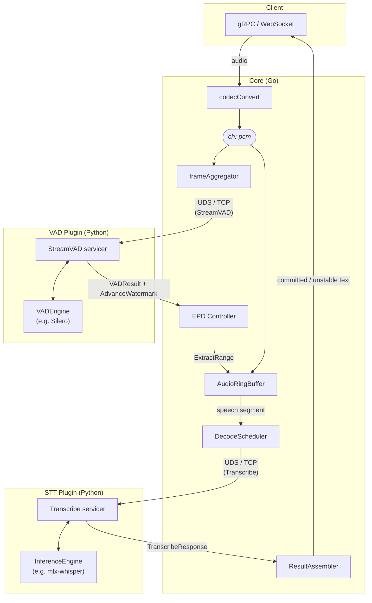
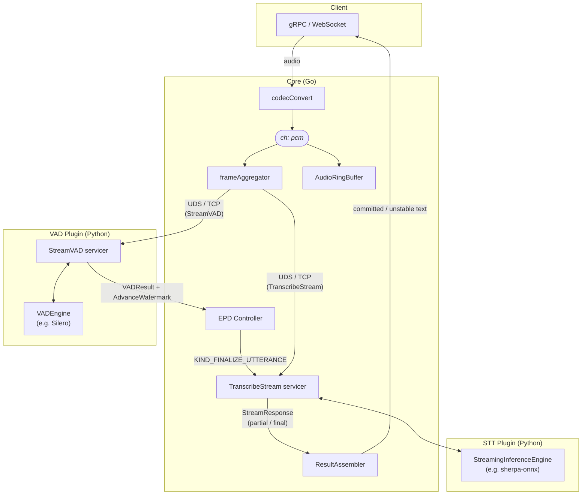

# SpeechMux

A Go-based streaming speech-to-text gateway that orchestrates multiple STT engines and VAD plugins. Core (Go) handles session management, routing, end-of-speech detection, backpressure, and fault recovery. VAD and Inference plugins (Python) run as gRPC sidecars over Unix domain sockets (local) or TCP (Docker).

## Architecture

**Batch engine** (e.g. mlx-whisper) — VAD drives utterance boundaries; Core extracts segments and sends each as a single Transcribe RPC:



**Streaming engine** (e.g. sherpa-onnx) — audio flows continuously to the STT plugin; the ring buffer and batch decode scheduler are bypassed. VAD still runs in parallel: Core's EPD Controller sends `KIND_FINALIZE_UTTERANCE` when silence is detected (`endpointing_source: core`):



- **Frame aggregation**: Core re-frames client audio chunks to the VAD plugin's `optimal_frame_ms` before sending, reducing IPC overhead.
- **Watermark-based trim**: `AudioRingBuffer.Trim()` only evicts entries with `sequence_number <= confirmedWatermark` AND age exceeding `max_buffer_sec`. Audio not yet confirmed by VAD is never evicted regardless of age.
- **Backpressure**: When `AudioRingBuffer.Append()` returns false, the pipeline goroutine blocks on `stream.Recv()`, filling the HTTP/2 flow control window and naturally throttling the client. In REALTIME mode the oldest entry is dropped instead to prevent mic stalls.
- **Committed / unstable text**: On each partial decode, Core computes the Longest Common Prefix (LCP) between the previous and current partial, then advances `committed_text` to the nearest word boundary (space) or punctuation boundary (`.,?!。、，！？…`) within the LCP. CJK text without spaces commits character-by-character at the LCP boundary. `committed_text` is monotonically increasing within an utterance. On `is_final`: `committed_text = full utterance text`, `unstable_text = ""`, and the assembler resets for the next utterance.

## Streaming Protocol

`StreamingRecognize` is a single bidirectional gRPC stream. The first message must be `session_config`; all subsequent messages are `audio` or `signal`.

**Client → Core:**

| Message | When |
|---------|------|
| `session_config` | First message only — creates the session |
| `audio` (bytes) | PCM / WAV / encoded audio chunks |
| `signal { is_last: true }` | End of audio — triggers final decode |

**Core → Client:**

| Message | When |
|---------|------|
| `session_created` | First response — echoes negotiated audio + recognition config |
| `recognition_result` | Streamed continuously — `committed_text`, `unstable_text`, `is_final`, `engine_name` |
| `stream_error { error_code, retryable }` | On error — stream closes after this |

On `ERR3004` (VAD stream failure) or `ERR3005` (buffer overflow), `retryable: true` — the client should open a new stream and replay the last ~2 s of audio to avoid losing the unstable segment.

## Repositories

Each component lives in its own repository under the `speechmux` GitHub organization.

### Infrastructure

| Repo | Language | Role |
|------|----------|------|
| [`proto`](https://github.com/speechmux/proto) | Protobuf | Proto definitions + generated Go/Python code |
| [`core`](https://github.com/speechmux/core) | Go | gRPC/WS server, session management, EPD, decode scheduling, routing |

### VAD Plugins

| Repo | Language | Role |
|------|----------|------|
| [`plugin-vad`](https://github.com/speechmux/plugin-vad) | Python | VAD plugin base (servicer, VADEngine Protocol, Dummy engine) |
| [`plugin-vad-silero`](https://github.com/speechmux/plugin-vad-silero) | Python | Silero VAD engine |

### STT Plugins

| Repo | Language | Role |
|------|----------|------|
| [`plugin-stt`](https://github.com/speechmux/plugin-stt) | Python | STT plugin base (servicer, InferenceEngine + StreamingInferenceEngine Protocols, Dummy engine) |
| [`plugin-stt-sherpa-onnx`](https://github.com/speechmux/plugin-stt-sherpa-onnx) | Python | sherpa-onnx Zipformer streaming engine (CPU/ARM, any language) |
| [`plugin-stt-mlx-whisper`](https://github.com/speechmux/plugin-stt-mlx-whisper) | Python | mlx-whisper batch engine (MLX, Apple Silicon) |

### Clients

| Repo | Language | Role |
|------|----------|------|
| [`client-web`](https://github.com/speechmux/client-web) | TS/Python | Next.js 15 frontend + FastAPI WebSocket proxy |
| [`client-cli`](https://github.com/speechmux/client-cli) | Python | CLI client (file, batch, microphone) |

## Quick Start

### Prerequisites

- Go 1.25+
- Python 3.13+
- [uv](https://docs.astral.sh/uv/) package manager
- Node.js 22+ (for `client-web` only)
- Docker + Docker Compose (for Docker deployment)

### Clone

```bash
git clone git@github.com:speechmux/speechmux.git
cd speechmux

make clone-base                    # proto, core, plugin-vad, plugin-stt

make clone-vad IMPL=silero         # plugin-vad-silero
make clone-stt IMPL=sherpa-onnx    # CPU / ARM streaming Zipformer (recommended)
make clone-stt IMPL=mlx-whisper    # Apple Silicon MLX batch engine

make clone-web                     # client-web (optional)
make clone-cli                     # client-cli (optional)
```

### Install

```bash
make setup    # creates .venv (Python 3.13) + installs all cloned plugins and clients

# Web client frontend — Node side needs a separate install
cd client-web/web && npm install && cd ../..
```

### Build

```bash
make build    # builds core/bin/speechmux-core
```

### Run (native macOS)

All processes are managed by `speechmux-core ctl`. It starts VAD, STT, and Core in declaration order and restarts on failure. Process logs go to `/tmp/speechmux/<name>.log`.

```bash
make up       # build + start all processes via ctl (workspace.yaml)
make down     # graceful stop
make status   # check process states
make logs     # tail all logs
```

To run components manually instead:

```bash
.venv/bin/python3 -m speechmux_plugin_vad.main --config plugin-vad/config/vad.yaml &
.venv/bin/python3 -m speechmux_plugin_stt.main --config plugin-stt/config/inference-onnx.yaml &
core/bin/speechmux-core --config core/config/core.yaml --plugins core/config/plugins.yaml
```

### Run (Docker)

```bash
cp .env.example .env           # edit ports, MODELS_DIR, auth tokens as needed

make docker-build              # build all images (DOCKER_PROFILE=sherpa by default)
make docker-up                 # start stack in background
make docker-logs               # tail core + vad-silero + stt-sherpa
make docker-logs-stt           # stt-sherpa only
make docker-logs-vad           # vad-silero only
make docker-down               # stop and remove containers
```

Override the STT profile if using a different engine:

```bash
make docker-build DOCKER_PROFILE=faster-whisper
make docker-up    DOCKER_PROFILE=faster-whisper
```

Models are mounted read-only from `MODELS_DIR` (default: `./plugin-stt-sherpa-onnx/models`). Expected layout:

```
plugin-stt-sherpa-onnx/models/
  ko-streaming/
    encoder-epoch-99-avg-1.int8.onnx
    decoder-epoch-99-avg-1.int8.onnx
    joiner-epoch-99-avg-1.int8.onnx
    tokens.txt
```

See `make download-models` for instructions.

### Remote Access (Tailscale)

```bash
scripts/remote-access.sh          # enable HTTPS on port 8444 via Tailscale
scripts/remote-access.sh stop     # disable
```

### Transcribe (CLI)

```bash
.venv/bin/speechmux file audio.wav --lang ko
.venv/bin/speechmux batch ./audio_dir/ --lang ko --output ./results/
.venv/bin/speechmux mic --lang ko
```

## Configuration

All configuration is YAML-based. Every variable has an inline comment explaining its purpose and unit.

### Local dev

| File | Purpose |
|------|---------|
| `core/config/core.yaml` | Server ports, session limits, stream pipeline tuning, auth, TLS, OTel |
| `core/config/plugins.yaml` | VAD/inference plugin endpoints (`socket` for UDS), routing mode, health check intervals |
| `core/config/workspace.yaml` | Process list for `speechmux-core ctl` (command, args, working_directory, restart policy) |
| `plugin-vad/config/vad.yaml` | VAD socket, engine, log level, concurrency, Silero thresholds |
| `plugin-stt/config/inference-onnx.yaml` | STT socket, sherpa-onnx Zipformer config (model paths, language routing) |

### Docker

| File | Purpose |
|------|---------|
| `deploy/docker/core-docker.yaml` | Core config for Docker (same schema as `core.yaml`) |
| `deploy/docker/plugins-docker.yaml` | Plugin endpoints using TCP `address` (Docker DNS) instead of UDS `socket` |
| `deploy/docker/vad-docker.yaml` | VAD config for Docker |
| `deploy/docker/inference-sherpa-docker.yaml` | STT config for Docker with model paths at `/models` |
| `.env.example` | Template for `.env` — port bindings, `MODELS_DIR`, auth tokens, CORS origins |

### Endpoint config: UDS vs TCP

Plugin endpoints support both Unix domain sockets (local dev) and TCP (Docker). Exactly one must be set:

```yaml
# Local dev (UDS)
endpoints:
  - id: stt-sherpa
    socket: /tmp/speechmux/stt-sherpa.sock

# Docker (TCP)
endpoints:
  - id: stt-sherpa
    address: stt-plugin:50061
```

### Decode Profiles

`core.yaml` includes named decode profiles selected via `RecognitionConfig.decode_profile`:

| Profile | beam_size | best_of | Use Case |
|---------|-----------|---------|----------|
| `realtime` | 1 | 1 | Live microphone, low latency |
| `accurate` | 5 | 5 | Batch transcription, higher accuracy |

### Plugin Routing Modes

Configured in `plugins.yaml` under `inference.routing_mode`:

| Mode | Behavior |
|------|----------|
| `round_robin` | Distribute sessions sequentially across healthy endpoints |
| `least_connections` | Pick endpoint with fewest in-flight requests |
| `active_standby` | Prefer highest-priority endpoint; failover if unhealthy |

### Plugin Circuit Breaker

```
CLOSED ──[failure_threshold consecutive failures]──→ OPEN
OPEN   ──[half_open_timeout_sec elapsed]──────────→ HALF_OPEN
HALF_OPEN ──[HealthCheck pass]──→ CLOSED
HALF_OPEN ──[HealthCheck fail]──→ OPEN
```

### Config Hot-reload

`core.yaml` reloads on SIGHUP (`kill -HUP <pid>`):

| When | Fields |
|------|--------|
| **Immediate** | `vad_silence_sec`, `vad_threshold`, `decode_timeout_sec`, `speech_rms_threshold`, `partial_decode_interval_sec` |
| **New sessions only** | `max_sessions`, `auth_*`, `codec.target_sample_rate`, `rate_limit.*`, `decode_profiles.*` |
| **Requires restart** | `grpc_port`, `http_port`, `ws_port`, `tls.*` |
| **Dynamic via Admin API** | `plugins.yaml` endpoints — added/removed at runtime without restart |

## Error Codes

All errors follow the `ERR####` scheme. Codes are permanently assigned and never reused.

| Range | Category | Examples |
|-------|----------|----------|
| `ERR1xxx` | Client errors | ERR1001 missing field, ERR1004 unauthenticated, ERR1012 rate limited |
| `ERR2xxx` | Decode pipeline | ERR2001 decode timeout, ERR2005 all plugins unavailable, ERR2008 queue full |
| `ERR3xxx` | Internal errors | ERR3003 codec failure, ERR3004 VAD stream failure, ERR3005 buffer overflow |
| `ERR4xxx` | Admin/HTTP | ERR4001 admin disabled, ERR4004 invalid admin token |

Plugin errors (`PluginErrorCode`) are translated to Core `ERR####` codes at the boundary:

| Plugin Error | Core Code | Meaning |
|-------------|-----------|---------|
| `PLUGIN_ERROR_MODEL_LOADING` | ERR2005 | Model still loading, retry later |
| `PLUGIN_ERROR_MODEL_OOM` | ERR2005 | GPU/memory exhausted |
| `PLUGIN_ERROR_INVALID_AUDIO` | ERR3003 | Audio format issue |
| `PLUGIN_ERROR_INFERENCE_FAILED` | ERR2002 | Inference exception |
| `PLUGIN_ERROR_CAPACITY_FULL` | ERR2008 | Concurrency limit exceeded |

## Testing

```bash
make test    # Go tests + pytest for every cloned plugin-* and client-cli
```

Or run each suite directly:

```bash
cd core && go test -race ./...

cd plugin-vad && uv run pytest tests/ -v && ruff check src/ && mypy src/
cd plugin-vad-silero && uv run pytest tests/ -v
cd plugin-stt && uv run pytest tests/ -v && ruff check src/ && mypy src/
cd plugin-stt-sherpa-onnx && uv run pytest tests/ -v

cd client-cli && uv run pytest tests/ -v

cd client-web/web && npm run lint
cd client-web/api && uv run pytest tests/ -v
```

## License

MIT
