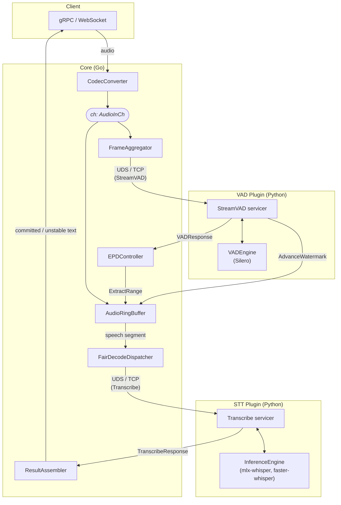
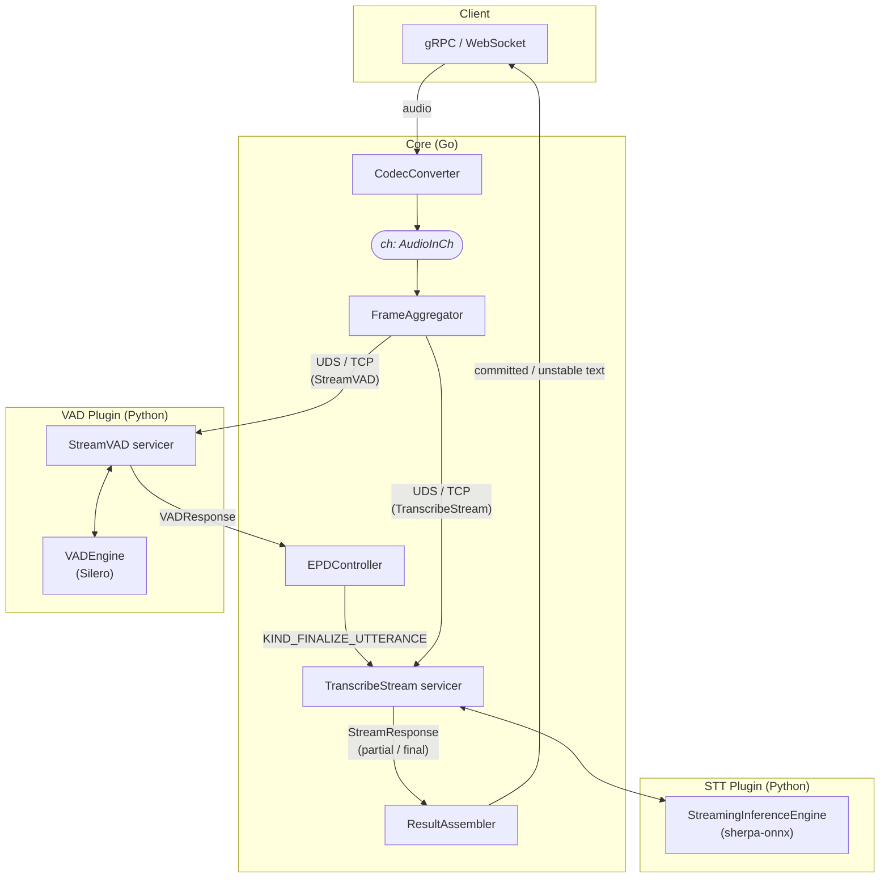

# Architecture overview

SpeechMux turns a continuous audio stream into incrementally-refined transcript text. A Go
**Core** process owns everything stateful — sessions, buffering, end-point detection,
routing, backpressure, failure recovery. Speech models run in separate **Python plugin
processes** that Core talks to over gRPC.

The guiding split is *dumb plugin, smart Core*: a plugin receives audio and returns model
output. It holds no session state that Core cannot reconstruct, makes no scheduling
decisions, and never sees a client. Everything else lives in Core.

---

## Processes

| Process | Language | Repo | Listens on | Role |
|---------|----------|------|-----------|------|
| `speechmux-core` | Go | `core` | gRPC `:50051`, HTTP `:8090`, WS `:8091` | Sessions, EPD, routing, decode scheduling, transports |
| VAD plugin | Python | `plugin-vad` + an engine | UDS or TCP | Per-frame speech/silence probability |
| STT plugin | Python | `plugin-stt` + an engine | UDS or TCP | Transcription (unary or streaming) |
| `client-web` API | Python | `client-web/api` | `:8000` | FastAPI WebSocket proxy: browser ↔ Core |
| `client-web` frontend | TypeScript | `client-web/web` | `:3020` | Next.js 15 UI, AudioWorklet mic capture |
| `client-cli` | Python | `client-cli` | — | gRPC CLI: `file`, `batch`, `mic` |

Plugin and Core processes are supervised by `speechmux-core ctl` locally
(see [../operations/deployment.md](../operations/deployment.md)), or by Docker Compose.

---

## Batch decode path

Whisper-family engines cannot decode incrementally. Core buffers audio, uses VAD to find
where the utterance ends, cuts that segment out of the ring buffer, and sends it as one
unary `Transcribe` call. Partial results come from periodically re-decoding the
speech-so-far.

## Streaming decode path

sherpa-onnx decodes continuously. Audio flows straight into a persistent
`TranscribeStream`, and the batch dispatcher is not used. VAD still runs in parallel when
`endpointing_source: core` — Core sends `KIND_FINALIZE_UTTERANCE` on detected silence. With
`endpointing_source: engine`, Core skips VAD entirely and the engine finalizes on its own.

Which path a session takes is decided at session start from
`InferenceCapabilities.streaming_mode` reported by the routed plugin — not from
configuration. See [core-pipeline.md](core-pipeline.md#capability-dispatch).

---

## Core packages

`core/internal/`:

| Package | Responsibility |
|---------|----------------|
| `runtime` | Assembles the dependency graph (`Application`), runs the servers, 3-phase graceful shutdown, SIGHUP config reload |
| `transport` | gRPC server, WebSocket handler, HTTP server (`/health`, `/metrics`, `/admin/*`) |
| `session` | `Session` / `Manager`: lifecycle, negotiated settings, auth, park-and-resume, idle reaper |
| `stream` | The audio pipeline: ring buffer, frame aggregator, EPD, decode engines, fair dispatcher, result assembler |
| `plugin` | gRPC clients for VAD and inference, endpoint circuit breakers, `PluginRouter` |
| `config` | YAML structs, loader, validation, TLS construction |
| `codec` | Encoding conversion to PCM S16LE at the target sample rate |
| `errors` | The `ERR####` registry and gRPC/HTTP mapping |
| `metrics` | Prometheus registry and the `MetricsObserver` interface |
| `tracing` | OpenTelemetry setup (no-op when no endpoint is configured) |
| `storage` | Optional best-effort session audio recording |
| `ratelimit` | Token-bucket limiters for session creation and HTTP |
| `health` | Neutral health-status types, kept separate to break an import cycle |
| `ctl` | The `speechmux-core ctl` process supervisor |

---

## External dependencies

**Go (Core)** — gRPC, `protobuf`, `nhooyr.io/websocket`, `prometheus/client_golang`,
OpenTelemetry SDK + OTLP gRPC exporter, `lmittmann/tint` (colour log handler),
`golang.org/x/sync/errgroup`, `gopkg.in/yaml.v3`.

**Python (plugins)** — `grpcio`, `protobuf`, `pyyaml`, plus one ML runtime per engine
package: `silero-vad` + `torch`/`torchaudio`, `mlx-whisper`, `faster-whisper`,
`sherpa-onnx`, and `numpy`.

**Python (clients)** — `grpcio`, `click`, `soundfile`, `scipy`, `numpy`,
optional `sounddevice` (mic); `client-web/api` uses FastAPI + `websockets` + Pydantic.
`client-cli` shells out to `ffmpeg` when `soundfile` cannot open a container.

**TypeScript** — Next.js 15, React 19, `lucide-react`.

**Toolchain** — Go 1.25+, Python 3.13 (`uv`), Node 22+, `protoc` + `protoc-gen-go` +
`protoc-gen-go-grpc` + `grpcio-tools`, `buf` (proto lint / breaking-change checks), Docker.

---

## Where to go next

- Session lifecycle, goroutines, buffering, engines: [core-pipeline.md](core-pipeline.md)
- Plugin framework and how engines plug in: [plugin-system.md](plugin-system.md)
- Metrics, traces, logs, health: [observability.md](observability.md)
- Wire formats: [../api/client-protocol.md](../api/client-protocol.md),
  [../api/plugin-protocol.md](../api/plugin-protocol.md)
- Why it is shaped this way: [../decisions/](../decisions/)
